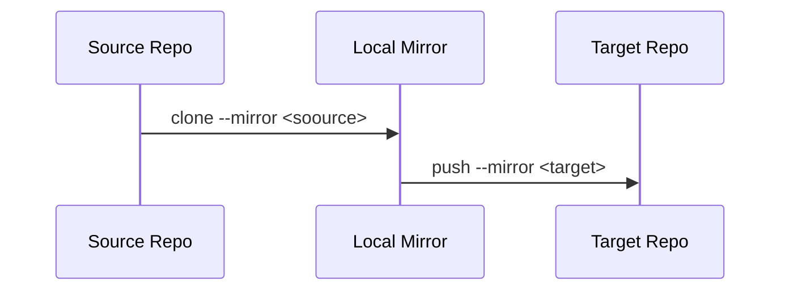

## How to migrate git repository


Sometimes you need to migrate an existing Git repository into a new repository. The migration needs to guarantee that the full commit history, branches, etc. is preserved.

In my case I am going to migrate a Git repository from one Azure DevOps organization into a new repository from another Azure DevOps organization. The solution applies not only to Azure DevOps git, but to any git repository and can be used to migrate even between different platforms - GitHub, GitLab, Bitbucket, etc.

## Pre-requisites

* You have an existing repository `myapp` with URL https://dev.azure.com/hemus/svetlina/_git/myapp
* You have an empty target repository `newapp` with URL https://dev.azure.com/asizen/svetlina/_git/newapp

  **WARNING:** If the target repository is not empty, it will be completely overwritten!

## How to do it?

I am defining two environment variables to make the following steps more clear:

```bash
$ SOURCE_REPO=https://dev.azure.com/hemus/svetlina/_git/myapp

$ TARGET_REPO=https://dev.azure.com/asizen/svetlina/_git/newapp
```


**Step 1:** Mirror clone

```bash
$ git clone --mirror $SOURCE_REPO
Cloning into bare repository 'myapp.git'...
remote: Azure Repos
remote: Found 79 objects to send. (1 ms)
Unpacking objects: 100% (79/79), done.
```


**Step 2:** Push to the new repo

```bash
$ cd myapp.git
$ git push --mirror $TARGET_REPO
Enumerating objects: 79, done.
Counting objects: 100% (79/79), done.
Delta compression using up to 8 threads
Compressing objects: 100% (61/61), done.
Writing objects: 100% (79/79), 7.77 KiB | 795.00 KiB/s, done.
Total 79 (delta 24), reused 0 (delta 0)
remote: Analyzing objects... (79/79) (7 ms)
remote: Storing packfile... done (325 ms)
remote: Storing index... done (86 ms)
To https://dev.azure.com/asizen/svetlina/_git/newapp
 * [new branch]      main -> main
```


**Step 3:** Validate the migration

First clone the new repository.

```bash
$ cd ..
$ git clone $TARGET_REPO
Cloning into 'newapp'...
cd newapp
remote: Azure Repos
remote: Found 79 objects to send. (29 ms)
Unpacking objects: 100% (79/79), done.
$ cd newapp
```

You can browse the content of the repository:

```bash
$ ls -lR
.:
total 4
drwxr-xr-x 1 ivang 197609   0 May 15 08:45 azure-pipelines/
-rw-r--r-- 1 ivang 197609 985 May 15 08:45 README.md

./azure-pipelines:
total 0
drwxr-xr-x 1 ivang 197609 0 May 15 08:45 pipelines/
drwxr-xr-x 1 ivang 197609 0 May 15 08:45 vars/
...
```

You should see the same content as in the source repository.

Check the branches.

```bash
$ git branch -r
$ git branch -r
  origin/HEAD -> origin/dev
  origin/dev
  origin/main
```


## How it works?

Using the `--mirror` option in when cloning the repository causes git to mirror the full content, create a *mirror* clone, of the repository into the local filesystem. The *mirror* maps local branches of the source to local branches of the target, it also maps all refs (including remote-tracking branches, notes etc.) and sets up a refspec configuration such that all these refs are overwritten by a `git remote update` in the target repository. The *mirror* clone does not generate a working copy. Let's see this in practice.

Regular clone creates a working copy of the repository:

```bash
$ git clone $SOURCE_REPO
Cloning into 'myapp'...
ls myappremote: Azure Repos
remote: Found 79 objects to send. (1 ms)
Unpacking objects: 100% (79/79), done.
$ ls myapp
azure-pipelines/  README.md
```

The mirror clone contains complete git repository snapshot:

```bash
$ git clone --mirror $SOURCE_REPO
$ ls myapp.git
config  description  HEAD  hooks/  info/  objects/  packed-refs  refs/
```

As you can see from the above listings, the mirror clone doesn't contain a working copy, but a snapshot of the entire git repository.

The `--mirror` option when pushing the repository instructs git that we want to replace the target git repository completely with the local snapshot.

## There's more...

* In this solution we use *mirror* clone of the repository. There is also a *bare* clone of the repository. *Mirror* clone is a kind of a *bare* clone. Check the `git clone` [documentation](https://git-scm.com/docs/git-clone) to learn about *bare* and *mirror* clones.

* In case you want to push only a single branch into another repository, check [How to move a full Git repository](https://www.atlassian.com/git/tutorials/git-move-repository) at Atlassian

* On migrating git repository at other sources:

  * [How to Migrate a Git Repository](https://gitenterprise.me/2016/03/30/how-to-migrate-a-git-repository/) at GitEnterprise
  * [Move Git repositories to another project with full-fidelity history](https://docs.microsoft.com/en-us/azure/devops/repos/git/move-git-repos-between-team-projects) at Microsoft

  

