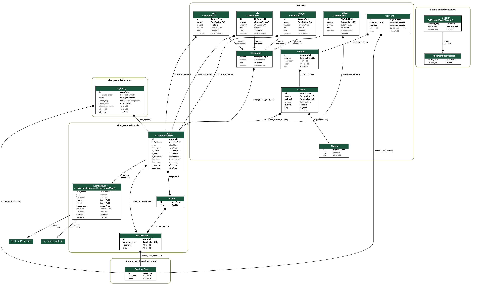
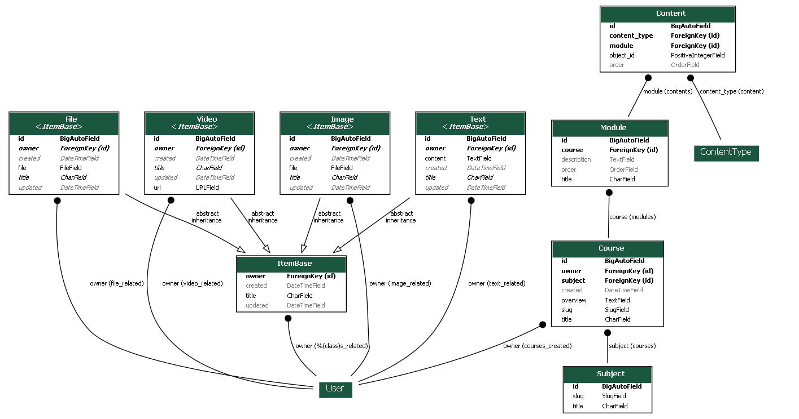
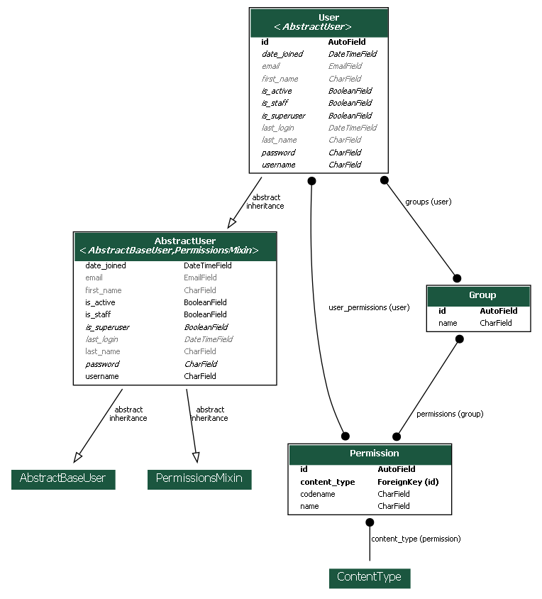
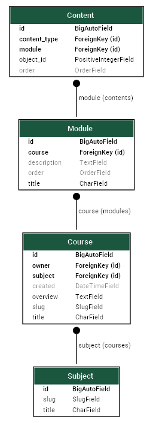

Generate Database Entity Relationships Diagram (ERD) from Django Models
########################################################################

Install `django-extensions`
******************************

Add `django-extensions` and `pydotplus` to `requirements.txt`:

.. code-block:: none
   :caption: requirements.txt

   # ...
   django-extensions
   pydotplus
   # ...

And run `pip` to apply the changes:

.. code-block:: console

   $ pip install -U -r requirements.txt
   ...

Register `django_extensions` application in `settings.py`:

.. code-block:: python
   :caption: elearn/settings.py
   :linenos:
   :emphasize-lines: 5

   INSTALLED_APPS = [
      # ...
      # 3rd party apps
      'drf_yasg',
      'django_extensions',
      # Local apps
      'courses',
   ]

Examine the command options:

.. code-block:: console

   $ python elearn\manage.py graph_models --help
	usage: manage.py graph_models [-h]
                  [--pygraphviz] [--pydot] [--dot] [--json] [--disable-fields]
                  [--disable-abstract-fields] [--group-models] [--all-applications]
                  [--output OUTPUTFILE] [--layout LAYOUT] [--theme THEME]
                  [--verbose-names] [--language LANGUAGE]
                  [--exclude-columns EXCLUDE_COLUMNS] [--exclude-models EXCLUDE_MODELS]
                  [--include-models INCLUDE_MODELS] [--inheritance] [--no-inheritance]
                  [--hide-relations-from-fields]
                  [--relation-fields-only RELATION_FIELDS_ONLY] [--disable-sort-fields]
                  [--hide-edge-labels]
                  [--arrow-shape {box,crow,curve,icurve,diamond,dot,inv,none,normal,tee,vee}]
                  [--color-code-deletions] [--rankdir {TB,BT,LR,RL}] [--version]
                  [-v {0,1,2,3}] [--settings SETTINGS] [--pythonpath PYTHONPATH]
                  [--traceback] [--no-color] [--force-color] [--skip-checks]
                  [app_label ...]

	Creates a GraphViz dot file for the specified app names. You can pass multiple app names and they
	will all be combined into a single model. Output is usually directed to a dot file.

	positional arguments:
	  app_label

	options:
	  -h, --help            show this help message and exit
	  --pygraphviz          Output graph data as image using PyGraphViz.
	  --pydot               Output graph data as image using PyDot(Plus).
	  --dot                 Output graph data as raw DOT (graph description language) text data.
	  --json                Output graph data as JSON
	  --disable-fields, -d  Do not show the class member fields
	  --disable-abstract-fields
							Do not show the class member fields that were inherited
	  --group-models, -g    Group models together respective to their application
	  --all-applications, -a
							Automatically include all applications from INSTALLED_APPS
	  --output OUTPUTFILE, -o OUTPUTFILE
							Render output file. Type of output dependend on file extensions. Use png or
							jpg to render graph to image.
	  --layout LAYOUT, -l LAYOUT
							Layout to be used by GraphViz for visualization. Layouts: circo dot fdp
							neato nop nop1 nop2 twopi
	  --theme THEME, -t THEME
							Theme to use. Supplied are 'original' and 'django2018'. You can create your
							own by creating dot templates in 'django_extentions/graph_models/themename/'
							template directory.
	  --verbose-names, -n   Use verbose_name of models and fields
	  --language LANGUAGE, -L LANGUAGE
							Specify language used for verbose_name localization
	  --exclude-columns EXCLUDE_COLUMNS, -x EXCLUDE_COLUMNS
							Exclude specific column(s) from the graph. Can also load exclude list from
							file.
	  --exclude-models EXCLUDE_MODELS, -X EXCLUDE_MODELS
							Exclude specific model(s) from the graph. Can also load exclude list from
							file. Wildcards (*) are allowed.
	  --include-models INCLUDE_MODELS, -I INCLUDE_MODELS
							Restrict the graph to specified models. Wildcards (*) are allowed.
	  --inheritance, -e     Include inheritance arrows (default)
	  --no-inheritance, -E  Do not include inheritance arrows
	  --hide-relations-from-fields, -R
							Do not show relations as fields in the graph.
	  --relation-fields-only RELATION_FIELDS_ONLY
							Only display fields that are relevant for relations
	  --disable-sort-fields, -S
							Do not sort fields
	  --hide-edge-labels    Do not show relations labels in the graph.
	  --arrow-shape {box,crow,curve,icurve,diamond,dot,inv,none,normal,tee,vee}
							Arrow shape to use for relations. Default is dot. Available shapes: box,
							crow, curve, icurve, diamond, dot, inv, none, normal, tee, vee.
	  --color-code-deletions
							Color the relations according to their on_delete setting, where it it
							applicable. The colors are: red (CASCADE), orange (SET_NULL), green
							(SET_DEFAULT), yellow (SET), blue (PROTECT), grey (DO_NOTHING) and purple
							(RESTRICT).
	  --rankdir {TB,BT,LR,RL}
							Set direction of graph layout. Supported directions: "TB", "LR", "BT", "RL",
							corresponding to directed graphs drawn from top to bottom, from left to
							right, from bottom to top, and from right to left, respectively. Default is
							TB.
	  --version             Show program's version number and exit.
	  -v {0,1,2,3}, --verbosity {0,1,2,3}
							Verbosity level; 0=minimal output, 1=normal output, 2=verbose output, 3=very
							verbose output
	  --settings SETTINGS   The Python path to a settings module, e.g. "myproject.settings.main". If
							this isn't provided, the DJANGO_SETTINGS_MODULE environment variable will be
							used.
	  --pythonpath PYTHONPATH
							A directory to add to the Python path, e.g.
							"/home/djangoprojects/myproject".
	  --traceback           Raise on CommandError exceptions.
	  --no-color            Don't colorize the command output.
	  --force-color         Force colorization of the command output.
	  --skip-checks         Skip system checks.

Install Robot Font on Windows
********************************

Download from `Google fonts <https://fonts.google.com/specimen/Roboto>`__.

Extract the zip package.

Select all the font files, right click and select `Install` from the menu.

Generate ER Model Diagram for All Applications
************************************************

.. code-block:: console

   $ python elearn/manage.py graph_models -a -g -o elearn_full_erd.png

The `-a` switch is used to generate ER diagram for all models. The `-g` switch is grouping models visually by application.

Generate Database Diagram for One or More Applications
*******************************************************

To generate model only for a single application, e.g. `courses`:

.. code-block:: console

   $ python elearn/manage.py graph_models -o elearn_courses_erd.png courses

One could generate ER diagram even for Django's core application's models:

Generate Database Diagram for Specific Models
***********************************************

.. code-block:: console

   $ python elearn/manage.py graph_models --pygraphviz -o elearn_course_models_erd.png courses -I Course,Module,Subject,Content

Same result could be achieved specifying models for all the applications:

.. code-block:: console

   $ python elearn/manage.py graph_models --pygraphviz -o elearn_course_models_erd.png -a -I Course,Module,Subject,Content

Install PyGraphViz on Windows
**********************************

Install `Graphviz <https://graphviz.org/download/#windows>`__ for your system.

Install `phygraphviz`:

.. code-block:: console

   $ pip install --global-option=build_ext --global-option="-IC:\Program Files\Graphviz\include" --global-option="-LC:\Program Files\Graphviz\lib" pygraphviz
   ...

