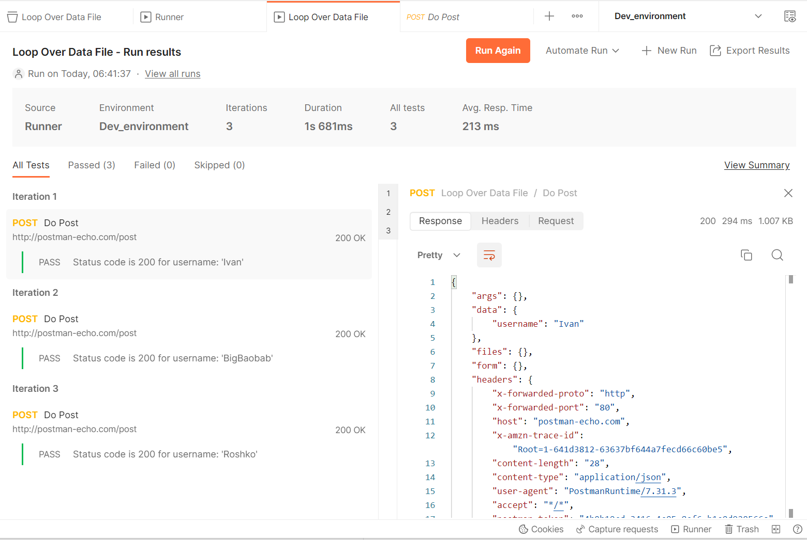

Execute Postman Request with Data File
==========================================

Problem
--------

You work for a company called "Amazing Success". The management of the company, during the last
night party, decided to give a salary increase to 10000 employees. You are given the task to
execute the promotion in a particular order. The list of employees is already prepared and you
have it as csv file `promotions.csv`.

To promote an employee, you need to call an API endpoint. Looking at the file you found your name
close to the bottom! You need to apply all promotions as soon as possible, while the management hasn't
reconsidered their generous decision.

Solution
---------

You create a Postman collection with a single request to promote a user. It took you 10 minutes. Now
yoiu run the collection against the data file containing list of employee promotions and go for some
recreational activities (War of Warcraft). The runner executes the request in a loop with
one iteration per line from the data file.

In the middle of the activity you get a call from the CEO (!!! you never talked to this guy !!!).
You expect troubles, but ... Being excited with your achievement to execute such a boring, routine
activity in such short period of time, he decided to give you another promotion!

Discussion
----------

To see how the solution works, we will use the Postman's echo API `http://postman-echo.com/post <http://postman-echo.com/post>`_.
Here is what the results of the run look like on my laptop.

Step 1. Create Postman collection
~~~~~~~~~~~~~~~~~~~~~~~~~~~~~~~~~~

I named my collection *Loop Over Data File* and there is nothing special about it.

Step 2. Create The Request
~~~~~~~~~~~~~~~~~~~~~~~~~~~

Now you create the request you want to be executed with each line of the file. The request should be
inside the collection *Loop Over Data File*. I named it *Do Post* as my request is going to perform a
POST request.

- Select *POST* as request method.
- Enter `http://postman-echo.com/post` as request URL
- Enter the body of the request as `raw` JSON:

  .. code-block:: json

      {
         "username": "{{username}}"
      }
- Enter following *Pre-request Script*:

  .. code-block:: javascript

      let currentUsername = pm.iterationData.get("username");

      if (!currentUsername) {
         currentUsername = pm.collectionVariables.get("username");
      }

      if (!currentUsername) {
         throw new Error('Collection variable "username" is not set. There are two possible solutions: (1) define current value for the collection variable "username" and send the request - upon completion the variable will be unset automatically, or (2) run the collection loading CSV file with "username" column.')
      }

      pm.collectionVariables.set("username", currentUsername);

- Enter following javascript as *Test* script:

  .. code-block:: javascript

      const username = pm.collectionVariables.get("username");

      pm.test(`Status code is 200 for username: '${username}'`, function () {
         pm.response.to.have.status(200);
      });

      pm.collectionVariables.unset("username")

Step 3. Prepare a Data File  to Loop the Request Over
~~~~~~~~~~~~~~~~~~~~~~~~~~~~~~~~~~~~~~~~~~~~~~~~~~~~~

.. code-block::

   username
   Ivan
   BigBaobab
   Roshko

Step 4. Run the Collection
~~~~~~~~~~~~~~~~~~~~~~~~~~~

You can do this in many ways. For example:

- Open the *Loop Over Data File* collection
- Click the Run button
- Modify the run settings
- Select a data file
- Click the *Run Loop Over Data File* button

   .. image:: postman-loop-run-collection-dialog.png
      :width: 60%

   Note I have selected "Persist responses for a session" so that
   the run results will also contain the actual server responses.
   By default only the headers and request body are persisted.

- Enjoy!

Additional Options
~~~~~~~~~~~~~~~~~~~~~

- You could use JSON file instead of CSV

Source Code - the Postman Collection
~~~~~~~~~~~~~~~~~~~~~~~~~~~~~~~~~~~~~~

Below is the JSON export for the Postman Collection. You can find it also the source for the `Run Loop Over Data File postman collection <https://gist.github.com/ivangeorgiev/d47ea65fe472b557454b57d92694f7e3>`_ in `github <https://gist.github.com/ivangeorgiev/d47ea65fe472b557454b57d92694f7e3>`_.

.. code-block:: json
   :caption: loop-over-data-file.postman_collection.json

   {
      "info": {
         "_postman_id": "ef0a1444-9fe4-4798-91ce-5febefd02bba",
         "name": "Loop Over Data File",
         "schema": "https://schema.getpostman.com/json/collection/v2.1.0/collection.json",
         "_exporter_id": "7243476"
      },
      "item": [
         {
            "name": "Do Post",
            "event": [
               {
                  "listen": "prerequest",
                  "script": {
                     "exec": [
                        "let currentUsername = pm.iterationData.get(\"username\");\r",
                        "\r",
                        "if (!currentUsername) {\r",
                        "    currentUsername = pm.collectionVariables.get(\"username\");\r",
                        "}\r",
                        "\r",
                        "if (!currentUsername) {\r",
                        "    throw new Error('Collection variable \"username\" is not set. There are two possible solutions: (1) define current value for the collection variable \"username\" and send the request - upon completion the variable will be unset automatically, or (2) run the collection loading CSV file with \"username\" column.')\r",
                        "}\r",
                        "\r",
                        "pm.collectionVariables.set(\"username\", currentUsername);\r",
                        ""
                     ],
                     "type": "text/javascript"
                  }
               },
               {
                  "listen": "test",
                  "script": {
                     "exec": [
                        "const username = pm.collectionVariables.get(\"username\");\r",
                        "\r",
                        "pm.test(`Status code is 200 for username: '${username}'`, function () {\r",
                        "    pm.response.to.have.status(200);\r",
                        "});\r",
                        "\r",
                        "pm.collectionVariables.unset(\"username\")\r",
                        ""
                     ],
                     "type": "text/javascript"
                  }
               }
            ],
            "request": {
               "method": "POST",
               "header": [],
               "body": {
                  "mode": "raw",
                  "raw": "{\r\n    \"username\": \"{{username}}\"\r\n}",
                  "options": {
                     "raw": {
                        "language": "json"
                     }
                  }
               },
               "url": {
                  "raw": "http://postman-echo.com/post",
                  "protocol": "http",
                  "host": [
                     "postman-echo",
                     "com"
                  ],
                  "path": [
                     "post"
                  ]
               }
            },
            "response": []
         }
      ],
      "event": [
         {
            "listen": "prerequest",
            "script": {
               "type": "text/javascript",
               "exec": [
                  ""
               ]
            }
         },
         {
            "listen": "test",
            "script": {
               "type": "text/javascript",
               "exec": [
                  ""
               ]
            }
         }
      ]
   }

The Loop Over Data File collection source as embedded Github gist.

.. raw:: html

   

Meta
-----

- Created on: 2023-03-24

