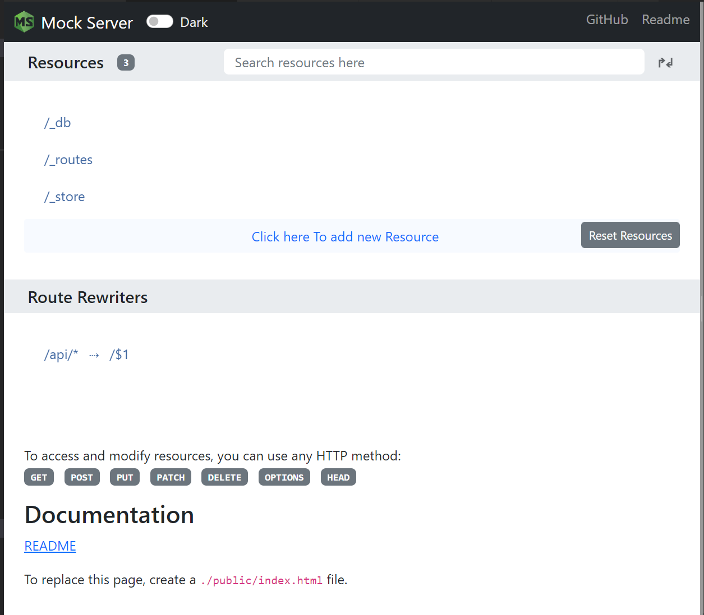
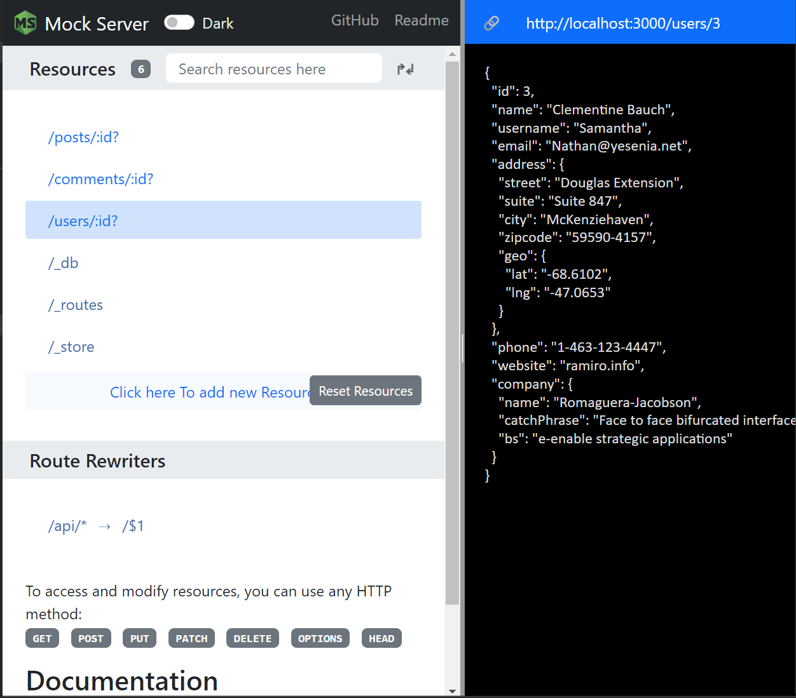

Mocking a REST API with VSCode Mock Server Extension
=====================================================

Resources
----------

Our API is based on the `{JSON} Placeholder <https://jsonplaceholder.typicode.com/>`_ free fake API.
The API supports posts, comments and users.

- /posts/:id
- /posts/:id/comments
- /comments/:id
- /users/:id

As you can see we want to be able to access comments for a post.

Preparation
-------------

To be able to follow my steps, you should have installed the `Mock Server extension for Visual Studio Code <https://marketplace.visualstudio.com/items?itemName=Thinker.mock-server>`_.

From the VSCode explorer, create a directory called mocks.

Right click the `mocks` directory and select the "Generate Mock Files" item from the context menu.

Right click the `mocks` directory once more and select the "Set as Server Root Folder" item from the context menu.

.. note::
   If you already have existing `db.json` file in your workspace root, the extension will
   use it. This is a perfectly valid scenario, but if it is not what you intended,
   you need to update the generated `settings.json` file to point to the desired `db.json`.

   Here is an example from my setup.

   .. code-block:: json
      :caption: .vscode/settings.json

      {
         "mock-server.settings.paths": {
            "root": "c:/Sandbox/PoC/vscode/mockserver/mocks/server",
            "db": "c:/Sandbox/PoC/vscode/mockserver/mocks/db.json",
            "middlewares": "c:/Sandbox/PoC/vscode/mockserver/mocks/middlewares.js",
            "injectors": "c:/Sandbox/PoC/vscode/mockserver/mocks/injectors.json",
            "store": "c:/Sandbox/PoC/vscode/mockserver/mocks/store.json",
            "rewriters": "c:/Sandbox/PoC/vscode/mockserver/mocks/rewriters.json",
            "environment": "c:/Sandbox/PoC/vscode/mockserver/mocks/env",
            "static": "",
            "snapshots": "c:/Sandbox/PoC/vscode/mockserver/snapshots"
         }
      }

Now open the `db.json` file and set the content to an empty object:

.. code-block:: json
   :caption: db.json

   {}

Update the `injectors.json` to an empty array:

.. code-block:: json
   :caption: injectors.json

   []

Update also the `rewriters.json` to have a single rule which will make our
REST api accessible at `/api` path.

.. code-block:: json
   :caption: rewriters.json

   {
   "/api/*": "/$1"
   }

Now you can start the mock server to see what it looks like when empty.

There are different ways to start the server:

- Click the `Mock it` button at the VSCode status bar to toggle the Mock Server status
- From the command pallete (:kbd:`Ctrl` + :kbd:`Shift` + :kbd:`P`) execute the `MockServer: Start Server`
  command.

Open the mock server in a browser: http://localhost:3000.

I agree. Doesn't look very exciting, but with almost zero effort we have a running mock server
ready to serve our data.

Defining the Base Resources
----------------------------

Let's define our base resources. Modify the `db.json` file and save it:

.. code-block:: json
   :caption: db.json

   {
      "/posts/:id?": {
         "_config": true,
         "fetch": "http://jsonplaceholder.typicode.com${req.url}",
         "fetchCount": -1
      },
      "/comments/:id?": {
         "_config": true,
         "fetch": "http://jsonplaceholder.typicode.com${req.url}",
         "fetchCount": -1
      },
      "/users/:id?": {
         "_config": true,
         "fetch": "http://jsonplaceholder.typicode.com${req.url}",
         "fetchCount": -1
      }
   }

After you save the `db.json`, the Mock Server is automatically restarted.
Now I am getting excited! Our mock server fully supports posts, comments,
and users.

Defining a Fetch Route
----------------------

First let's create a route which fetches all the comments for a post. This is a
proxy route which we will use in a rewrite so that we get neat and clean post comments
resource.

Update the `db.json` adding a `/proxy/comments/by-post` route:

.. code-block:: json
   :caption: db.json

   {
      "/posts/:id?": {
         "_config": true,
         "fetch": "http://jsonplaceholder.typicode.com${req.url}",
         "fetchCount": -1
      },
      "/comments/:id?": {
         "_config": true,
         "fetch": "http://jsonplaceholder.typicode.com${req.url}",
         "fetchCount": -1
      },
      "/users/:id?": {
         "_config": true,
         "fetch": "http://jsonplaceholder.typicode.com${req.url}",
         "fetchCount": -1
      },
      "/proxy/comments/by-post": {
         "_config": true,
         "fetch": "https://jsonplaceholder.typicode.com/comments",
         "middlewares": [
            "_AdvancedSearch"
         ]
      }
   }

After you save the updated `db.json` and the Mock Server is restarted, you
can query the comments resource by post id. Try http://localhost:3000/proxy/comments/by-post?postId=3.

This works thanks to the `_AdvancedSearch` `help middleware <https://github.com/R35007/Mock-Server/blob/main/README.md#advancedsearch>`_.

The only step left is to define the rewrite rule. Update the `rewriters.json`, adding a
rule to rewrite the requests to the post's comments resource to our proxy route:

.. code-block:: json
   :caption: rewriters.json

   {
   "/api/*": "/$1",
   "/posts/:id/comments": "/proxy/comments/by-post?postId=:id"
   }

Now we have routes for all required resources in place. Try http://localhost:3000/posts/5/comments
to see all comments for the post with id 5.

Fetch Routes With Data Files
-----------------------------

Fetch could be used to fetch local data files:

   #. Create a file `topics.json` in the `data` folder.

      .. code-block:: json
         :caption: data/topics.json

         [
            {"id": 1, "name":"Python"},
            {"id": 2, "name":"JavaScript"}
         ]

   #. Update the `db.json` file adding the `topics` resource.

      .. code-block:: json
         :caption: db.json

         {
            "/posts/:id?": {
               "_config": true,
               "fetch": "http://jsonplaceholder.typicode.com${req.url}",
               "fetchCount": -1
            },
            "/comments/:id?": {
               "_config": true,
               "fetch": "http://jsonplaceholder.typicode.com${req.url}",
               "fetchCount": -1
            },
            "/users/:id?": {
               "_config": true,
               "fetch": "http://jsonplaceholder.typicode.com${req.url}",
               "fetchCount": -1
            },
            "/proxy/comments/by-post": {
               "_config": true,
               "fetch": "https://jsonplaceholder.typicode.com/comments",
               "middlewares": [
                  "_AdvancedSearch"
               ]
            },
            "/topics": {
               "_config": true,
               "fetch": "data/topics.json"
            }
         }

Now we have another resource - `topics`. Note that you can add topics by
submitting POST requests.

Consider following requests:

.. code-block:: text

   @api_url = http://localhost:3000

   ###

   POST {{api_url}}/api/topics
   Content-Type: application/json

   {
      "name": "Scala"
   }

   ###

   GET {{api_url}}/api/topics

   ###

   DELETE {{api_url}}/api/topics/2

   ###

   GET {{api_url}}/api/topics

With these requests we add a new topic - 'Scala' and remove the topic with `id` 2.
The last request result is:

.. code-block:: json

   [
      { "id": 1, "name": "Python" },
      { "name": "Scala", "id": 3 }
   ]

I used the `REST Client <https://marketplace.visualstudio.com/items?itemName=humao.rest-client>`_
VSCode extension to interact with the Mock Server.

The changes you make are not persisted. When Mock Server is restarted (e.g. `db.json` is updated)
all the changes you have made will be lost.
