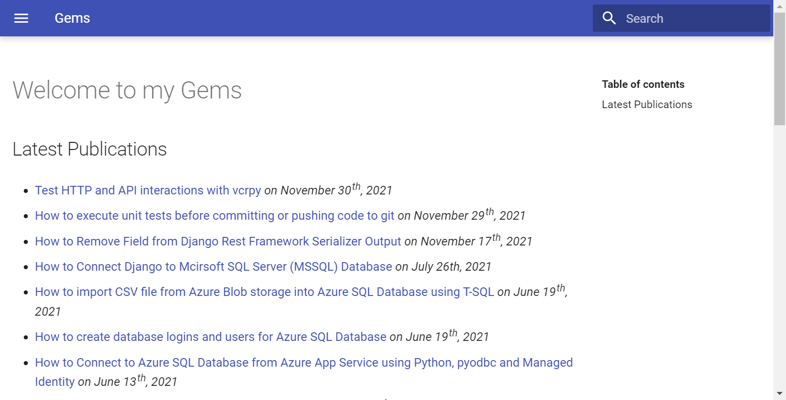
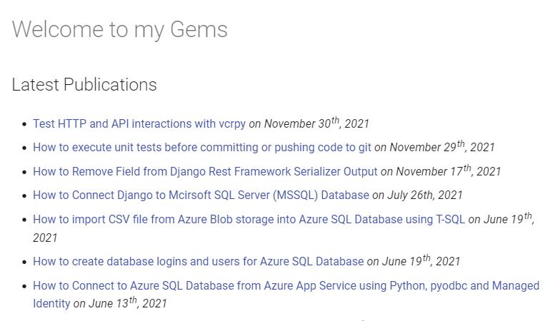

Web tests with Selenium
============================

`Selenium`_ WebDriver is a free open source package for automating interactions with a live browser. It implements the W3C `WebDriver`_ standard. To interact with each browser, we need a webdriver for that browser. For example, interacting with Chrome requires `chromedriver`_. You need to make sure `chromedriver`_ executable is downloaded and available in the system path. To make this process easier there are webdriver managers which automatcally download and install the webdriver executable. We are going to use `webdrivermanager`_.

.. note:: Further Information Resources

   There official `Selenium documentation`_ site is a great source of extensive information about Selenium. Information provided includes multiple supported programming languages, including Python.

   Books are also great learning resources:

   - `Browser Automation with Python and Selenium <https://learning.oreilly.com/videos/browser-automation-with/9781800560161/>`__ (7h video)
   - `Selenium Python Automation Testing from Scratch and Frameworks <https://learning.oreilly.com/videos/selenium-python-automation/9781800567733/>`__ (16.5h video)
   - `Python Testing with Selenium <https://learning.oreilly.com/library/view/python-testing-with/9781484262498/>`__
   - `Hands-On Selenium WebDriver with Java <https://learning.oreilly.com/library/view/hands-on-selenium-webdriver/9781098109998/>`__

To install `selenium pypi`_ and `webdrivermanager pypi`_ packages:

.. code-block:: console

   (.venv310) $ pip install -U selenium webdrivermanager
   ........................................

Notice that I am using a Python virtual environment. The webdrivers will be installed into the virtual environment.

Now you can install the webdriver using cli:

.. code-block:: console

   (.venv310) $ webdrivermanager chrome
   Downloading WebDriver for browser: "chrome"
   Driver binary downloaded to: "C:\Sandbox\projects\statuspage\python-cookbook\.venv310\WebDriverManager\chrome\96.0.4664.45\chromedriver_win32\chromedriver.exe"
   Driver copied to: C:\Sandbox\projects\statuspage\python-cookbook\.venv310\Scripts\chromedriver.exe

Webdriver can be downloaded and installed from Python code::

   from webdrivermanager import ChromeDriverManager
   ChromeDriverManager().download_and_install()

We are going to implement a test scenario which, using `Gherkin`_ language, could be described as:

.. code-block:: gherkin

   Scenario: Basic DuckDuckGo Search
   Given the DuckDuckGo Homepage is displayed
   When the user searches for "panda"
   Then the search result title contains "panda"
   And the search result query is "panda"
   And the search result links pertain to "panda"

Before start implementation of test steps we need to prepare a browser object:

.. code-block:: python
   :caption: testdrive_selenium.py

   from selenium import webdriver

   # Constant definitiions
   DUCKDUCKGO_HOME_URL = "https://www.duckduckgo.com"

   browser = webdriver.Chrome()
   try:
      # Browser calls should wait up to 10 seconds for elements to appear
      browser.implicitly_wait(10)

      # Given the DuckDuckGo Homepage is displayed
      # TODO ..................

      # When the user searches for "panda"
      # TODO ..................

      # Then the search result title contains "panda"
      # TODO ..................

      # And the search result query is "panda"
      # TODO ..................

      # And the search result links pertain to "panda"
      # TODO ..................

   finally:
      # Make sure browser quits even in case of error.
      browser.quit()

Let's implement the *Given the DuckDuckGo Homepage is displayed* step::

   # Given the DuckDuckGo Homepage is displayed
   browser.get(DUCKDUCKGO_HOME_URL)

To implement the *When the user searches for "panda"* step, we are defining two constants::

   # Constant definitiions
   # ....
   SEARCH_INPUT_HOME = (By.ID, "search_form_input_homepage")
   SEARCH_PHRASE = "panda"

   # ....

   # When the user searches for "panda"
   search_input = browser.find_element(*SEARCH_INPUT_HOME)
   search_input.send_keys(SEARCH_PHRASE + Keys.RETURN)

``find_element()`` method is used to execute a DOM search query. We are defining queries as contants. For example, to find the search input on the home page we are using search by id and are looking for ``search_form_input_homepage`` value. We assign this query to the ``SEARCH_INPUT_HOME`` constant.

We have implemented the *arrange* and *act* steps. We can now focus on *assert* steps (`arrange-act-assert`_ pattern). First *assert* step is *Then the search result title contains "panda"*::

   # ....
   # Then the search result title contains "panda"
   assert SEARCH_PHRASE in browser.title

To implement the *And the search result query is "panda"* step, we need to search the DOM tree for the search input and inspect its value, using ``get_attribute("value")`` call::

   # Constant definitiions
   # ....
   SEARCH_INPUT = (By.ID, "search_form_input")

   # ....
   # And the search result query is "panda"
   assert SEARCH_PHRASE == browser.find_element(*SEARCH_INPUT).get_attribute("value")

The last step *And the search result links pertain to "panda"* will search for the query text ("panda") in the result link texts:

   - Execute a DOM query and get all links
   - From all links extract the link text
   - Apply case insensitive filter to get only texts which contain the search query ("panda")
   - Assert that we end with at least one result::

         # Constant definitiions
         # ....
         RESULT_LINKS = (By.CSS_SELECTOR, "a.result__a")

         # ....

         # And the search result links pertain to "panda"
         links = browser.find_elements(RESULT_LINKS)
         link_texts = [link.text for link in links]
         matches = [t for t in link_texts if SEARCH_PHRASE.lower() in t.lower()]
         assert len(matches) > 0

Here is the full source of our test case:

.. code-block:: python
   :caption: testdrive_selenium.py

      #%%
      """To use Selenium, we need to download and install a webdriver."""
      from selenium import webdriver
      from webdrivermanager import ChromeDriverManager

      ChromeDriverManager().download_and_install()

      # %%
      from selenium.webdriver.common.by import By
      from selenium.webdriver.common.keys import Keys
      import time

      DUCKDUCKGO_HOME_URL = "https://www.duckduckgo.com"
      SEARCH_INPUT_HOME = (By.ID, "search_form_input_homepage")
      SEARCH_INPUT = (By.ID, "search_form_input")
      RESULT_LINKS = (By.CSS_SELECTOR, "a.result__a")
      SEARCH_PHRASE = "panda"

      # %%
      browser = webdriver.Chrome()

      try:
         # Browser calls should wait up to 10 seconds for elements to appear
         browser.implicitly_wait(10)

         # Given the DuckDuckGo Homepage is displayed
         browser.get(DUCKDUCKGO_HOME_URL)
         # When the user searches for "panda"
         search_input = browser.find_element(*SEARCH_INPUT_HOME)
         search_input.send_keys(SEARCH_PHRASE + Keys.RETURN)
         # Then the search result title contains "panda"
         assert SEARCH_PHRASE in browser.title
         # And the search result query is "panda"
         assert SEARCH_PHRASE == browser.find_element(*SEARCH_INPUT).get_attribute("value")
         # And the search result links pertain to "panda"
         links = browser.find_elements(*RESULT_LINKS)
         link_texts = [link.text for link in links]
         matches = [t for t in link_texts if SEARCH_PHRASE.lower() in t.lower()]
         assert len(matches) > 0
      finally:
         browser.quit()

.. code-block:: console

   $ python testdrive_selenium.py
   DevTools listening on ws://127.0.0.1:54297/devtools/browser/88ef6c9b-c87c-4989-b6ae-9fd61debe183

Browser testing with ``pytest-bdd``
------------------------------------

.. code-block::
   :caption: duckduckgo_search.feature

   Feature: DuckDuckGo Search
      Scenario: Basic DuckDuckGo Search
         Given the DuckDuckGo Homepage is displayed
         When the user searches for "<query>"
         Then the search result title contains "<query>"
         And the search result query is "<query>"
         And the search result links pertain to "<query>"

         Examples:
               | query      |
               | panda      |
               | big baobab |

.. code-block:: python
   :caption: test_duckduckgo_search.py

   import pytest
   from pytest_bdd import given, parsers, scenario, then, when
   from selenium import webdriver
   from selenium.webdriver.chrome.webdriver import WebDriver
   from selenium.webdriver.common.by import By
   from selenium.webdriver.common.keys import Keys

   DUCKDUCKGO_HOME_URL = "https://www.duckduckgo.com"
   SEARCH_INPUT_HOME = (By.ID, "search_form_input_homepage")
   SEARCH_INPUT = (By.ID, "search_form_input")
   RESULT_LINKS = (By.CSS_SELECTOR, "a.result__a")
   SEARCH_PHRASE = "panda"

   @pytest.fixture(scope="function")
   def browser():
      driver = webdriver.Chrome()
      yield driver
      driver.close()

   @scenario("duckduckgo_search.feature", "Basic DuckDuckGo Search")
   def test_duckduckgo_basic_search(browser):
      pass

   @given("the DuckDuckGo Homepage is displayed")
   def duckduckgo_homepage(browser):
      browser.get(DUCKDUCKGO_HOME_URL)
      return browser

   @when(parsers.parse('the user searches for "{query}"'))
   def search_for_query(browser, query):
      search_input = browser.find_element(*SEARCH_INPUT_HOME)
      search_input.send_keys(query + Keys.RETURN)

   @then(parsers.parse('the search result title contains "{text}"'))
   def assert_text_in_title(browser: WebDriver, text):
      assert text in browser.title

   @then(parsers.parse('the search result query is "{query}"'))
   def assert_search_result_query(browser: WebDriver, query):
      assert query == browser.find_element(*SEARCH_INPUT).get_attribute("value")

   @then(parsers.parse('the search result links pertain to "{query}"'))
   def assert_search_result_links_pertain_to_query(browser, query):
      links = browser.find_elements(*RESULT_LINKS)
      link_texts = [link.text for link in links]
      matches = [t for t in link_texts if query.lower() in t.lower()]
      assert len(matches) > 0

.. code-block:: console

   $ pytest
   ================================= test session starts =================================
   .........................................................
   collected 2 items

   test_basic.py
   DevTools listening on ws://127.0.0.1:55483/devtools/browser/aab7d2f6-f324-4e18-b6cc-54ec45b74ce3
   .
   DevTools listening on ws://127.0.0.1:55511/devtools/browser/2a59c47b-3d2a-4618-8a58-1f0e7c01aace
   .                                                                 [100%]

   ================================= 2 passed in 17.57s ==================================

Take a screenshot
------------------------------

Selenium driver has ``save_screenshot()`` method which saves a screenshot of the browser vieweable area to an image file:

.. code-block:: python

   URL = "https://igeorgiev.eu"
   with contextlib.closing(webdriver.Chrome()) as driver:
      driver.get(URL)
      driver.save_screenshot(str(SCREENSHOTS_DIR / "igeorgiev-home.png"))

Here is the screenshot saved by Selemium for me:

You can save also a screenshot of an element:

.. code-block:: python

   URL = "https://igeorgiev.eu"
   with contextlib.closing(webdriver.Chrome()) as driver:
      driver.get(URL)
      content = driver.find_element(By.CSS_SELECTOR, ".md-content")
      content.screenshot(str(SCREENSHOTS_DIR / "igeorgiev-content.png"))

And the screenshot of the element looks like:

The builtin methods provided by Selenium save only the visible part of the web page or an element. If you need to get a screenshot of the entire webpage or an element, you could use the `Selenium-Screenshot`_ package.

More information
~~~~~~~~~~~~~~~~~~~~

You can get more information:

- `Selenium TakeScreenshot <https://www.selenium.dev/documentation/webdriver/browser/windows/#takescreenshot>`_ from the official Selenium documentation.
- `Selenium-Screenshot`_ --- take screenshots from entire webpage or element.

.. _arrange-act-assert: https://automationpanda.com/2020/07/07/arrange-act-assert-a-pattern-for-writing-good-tests/
.. _chromedriver: https://sites.google.com/chromium.org/driver/
.. _gherkin: https://cucumber.io/docs/gherkin/
.. _selenium: `selenium documentation`_
.. _selenium documentation: https://www.selenium.dev/documentation/
.. _selenium readthedocs: https://selenium-python.readthedocs.io/
.. _selenium pypi: https://pypi.org/project/selenium/
.. _Selenium-Screenshot: https://github.com/PyWizards/Selenium_Screenshot
.. _webdriver: https://www.w3.org/TR/webdriver/
.. _webdrivermanager: https://github.com/rasjani/webdrivermanager
.. _webdrivermanager pypi: https://pypi.org/project/webdrivermanager/
