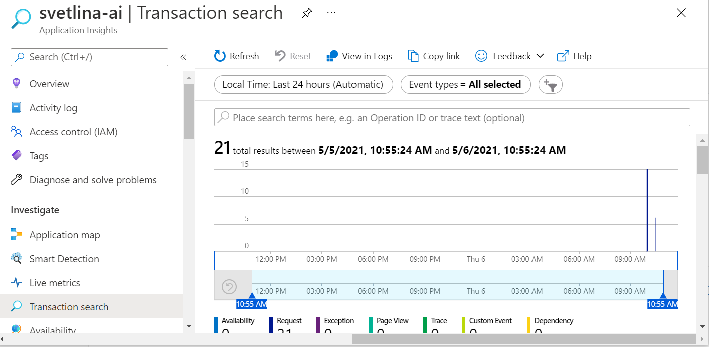
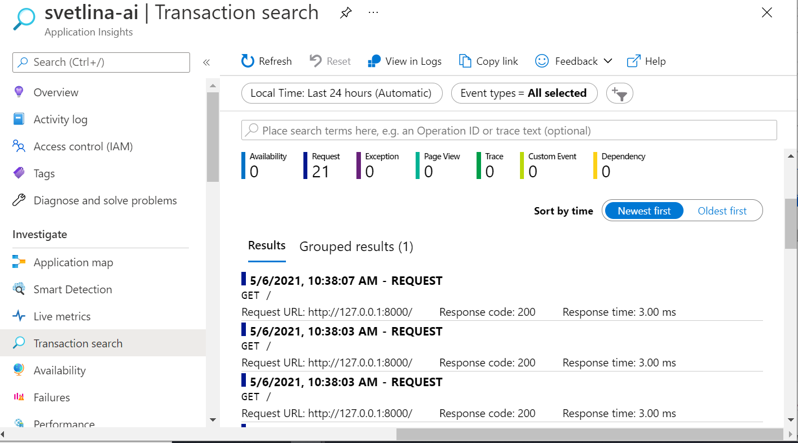

# How to enable  tracing in Django with OpenCensus


## Preparation

1. Create resource group `svetlina`
2. Create Log Analytics Workspace `svetlina-ws`
3. Create App Insights `svetlina-ai`, connected to `svetlina-ws`
   * Go to the App Insights *Properties* and note down the connection string.
4. Create Web App `svetlina`
   * Modify Deployment Center -> Source: Local Git
   * Save
   * Note the Git clone url: `https://svetlina.scm.azurewebsites.net:443/svetlina.git`
   * Define user credentials and note them down.
5. Clone the repository
   * Provide credentials defined earlier. Git will remember in Windows Credentials store.  In case you need to change them, open Windows Credential Manger -> Windows Credentials and remove the credentials `git:https://svetlina.scm.azurewebsites.net
6. Python Virtual Environment:

```bash
$ git clone https://svetlina.scm.azurewebsites.net:443/svetlina.git
...
$ cd svetlina
$ py -3.8 -m venv .venv38
$ . .venv38/Scripts/activate
...

```


## Install Python Dependencies

Create `requirements.txt` file:

```
django
opencensus-ext-django
opencensus-ext-ocagent
opencensus-ext-azure
```

Install the dependencies:

```bash
$ pip install -r requirements.txt
```


## Create Django App


### Generate Default Django Site

```bash
$ django-admin startproject mysite . # Note the trailing dot
```

This will generate a default Django project in the current directory.

```bash
$ cd mysite
$ django-admin startapp firstapp
$ cd ..
```

Let's sync the database.

```bash
$ python manage.py migrate
```

We are also creating an initial user named `admin` with a password of `password123`.

```bash
$ python manage.py createsuperuser --email admin@example.com --username admin
```


### Update `settings.py`

You can find the `settings.py`  file under the `mysite` directory.

For tracing Django requests, you will need to add the following line to the `MIDDLEWARE` section in the Django `settings.py` file.

```python
MIDDLEWARE = [
    ...
    'opencensus.ext.django.middleware.OpencensusMiddleware',
]
```

Additional configuration can be provided, please read [Customization](https://github.com/census-instrumentation/opencensus-python#customization) for a complete reference. In our case we need to provide exporter so that data is exported to Azure App Insights.

```python
OPENCENSUS = {
    'TRACE': {
        'SAMPLER': 'opencensus.trace.samplers.ProbabilitySampler(rate=1)',
        'EXPORTER': '''opencensus.ext.azure.trace_exporter.AzureExporter(
                  connection_string='<your-app-insights-connection-string-here>',
        )''',
    }
}

```

You also need to modify the `ALLOWED_HOSTS` list. Add your azure WebApp domain name:

```python
ALLOWED_HOSTS = ['localhost', 'svetlina.azurewebsites.net']
```

### Test the Site Locally

Start Django server

```bash
$ python manage.py runserver
Watching for file changes with StatReloader
Performing system checks...

System check identified no issues (0 silenced).

You have 18 unapplied migration(s). Your project may not work properly until you apply the migrations for app(s): admin, auth, contenttypes, sessions.
Run 'python manage.py migrate' to apply them.
May 06, 2021 - 09:46:59
Django version 3.2.1, using settings 'mysite.settings'
Starting development server at http://127.0.0.1:8000/
Quit the server with CTRL-BREAK.
...........
```

Open a browser at http://127.0.0.1:8000/ 

Open your Application Insights in Azure Portal and go to *Search Transactions*. You should be able to see your views. 

*__Note:__ It might take some time for the transactions to show up in App Insights.*







Stop the local server by pressing CTRL+C in the console window.

## Publish the Site

```bash
$ git add .
$ git commit -m "initial version"
$ git push
....
```

The last `git push` command will show detailed log how the app is being built and published to the WebApp.


### Test the Live Site

Open the site: https://svetlina.azurewebsites.net/


Open *Transaction Search* for your AppInsights in Azure Portal:


## Things to Consider

### Keep the AppInsight Connection String Secret

We embedded the connection string directly into the code, because we are doing a quick PoC. Also the code is not leaving our local machine and the WebApp.

When you are working on real project, secrets should be stored in Key Vault and/or as Application Setting for the WebApp.


### Publish to Another Git

For example, to publish on Github, create empty repository and use the similar commands:

```bash
$ git remote add github https://github.com/ivangeorgiev/django-appinsight-opencensus.git
$ git push -u github master
```

This is how I published the repository: https://github.com/ivangeorgiev/django-appinsight-opencensus


## REST API with Django REST Framework

Let's add some REST API endpoints.

### Serializers

We are defining some serializers. Let's create a new module named `mysite/firstapp/serializers.py` that we'll use for our data representations.

```python
from django.contrib.auth.models import User, Group
from rest_framework import serializers


class UserSerializer(serializers.HyperlinkedModelSerializer):
    class Meta:
        model = User
        fields = ['url', 'username', 'email', 'groups']


class GroupSerializer(serializers.HyperlinkedModelSerializer):
    class Meta:
        model = Group
        fields = ['url', 'name']
```


### Views

Modify the default `mysite/firstapp/views.py`.

```python
from django.contrib.auth.models import User, Group
from rest_framework import viewsets
from rest_framework import permissions
from mysite.firstapp.serializers import UserSerializer, GroupSerializer


class UserViewSet(viewsets.ModelViewSet):
    """
    API endpoint that allows users to be viewed or edited.
    """
    queryset = User.objects.all().order_by('-date_joined')
    serializer_class = UserSerializer
    permission_classes = [permissions.IsAuthenticated]


class GroupViewSet(viewsets.ModelViewSet):
    """
    API endpoint that allows groups to be viewed or edited.
    """
    queryset = Group.objects.all()
    serializer_class = GroupSerializer
    permission_classes = [permissions.IsAuthenticated]

```

### URLs

Define the REST endpoints. Modify the `mysite/urls.py`:

```python
from django.urls import include, path
from rest_framework import routers
from mysite.firstapp import views

router = routers.DefaultRouter()
router.register(r'users', views.UserViewSet)
router.register(r'groups', views.GroupViewSet)

urlpatterns = [
    path('', include(router.urls)),
    path('api-auth/', include('rest_framework.urls', namespace='rest_framework')),
]
```


### Settings

Update `mysite/settings.py`.

Add settings for the REST Framework:

```python
REST_FRAMEWORK = {
    'DEFAULT_PAGINATION_CLASS': 'rest_framework.pagination.PageNumberPagination',
    'PAGE_SIZE': 10
}
```

Add `rest_framework` to `INSTALLED_APPS`:

```python
INSTALLED_APPS = [
    ...
    'rest_framework',
]
```


### Test our API

```bash
$ python manage.py runserver
```

You can open the home page http://localhost:8000 and explore the API.

You can also use `curl`, `Postman` or other tools.

```bash
$ bash: curl -H 'Accept: application/json; indent=4' -u admin:password123 http://127.0.0.1:8000/users/
....
```


## Reference

* https://github.com/census-instrumentation/opencensus-python/tree/master/contrib/opencensus-ext-azure

* https://github.com/census-instrumentation/opencensus-python

* https://github.com/census-instrumentation/opencensus-python/tree/master/contrib/opencensus-ext-django

* https://docs.djangoproject.com/en/3.2/intro/tutorial01/

* https://github.com/Basma-Elsaify/opencensus-python/tree/master/contrib/opencensus-ext-fastapi/opencensus/ext/fastapi

* https://pypi.org/project/django-health-check/

* https://docs.microsoft.com/en-us/azure/app-service/monitor-instances-health-check

  


