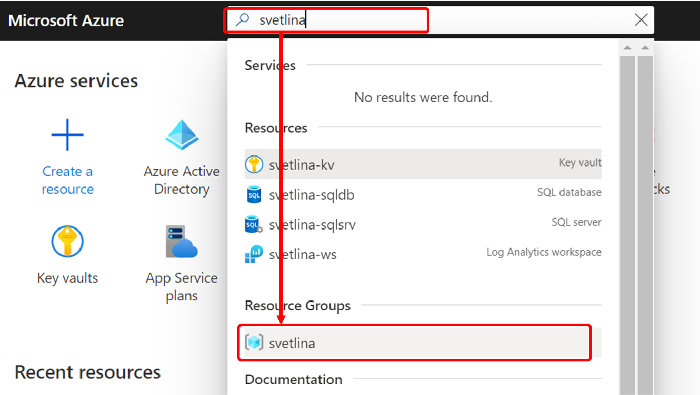
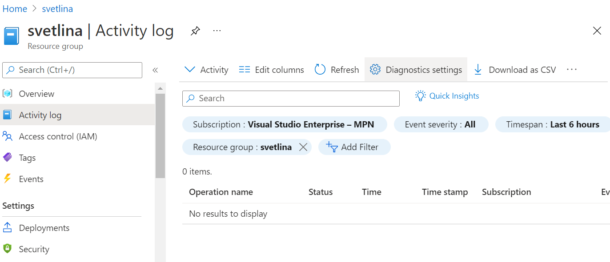
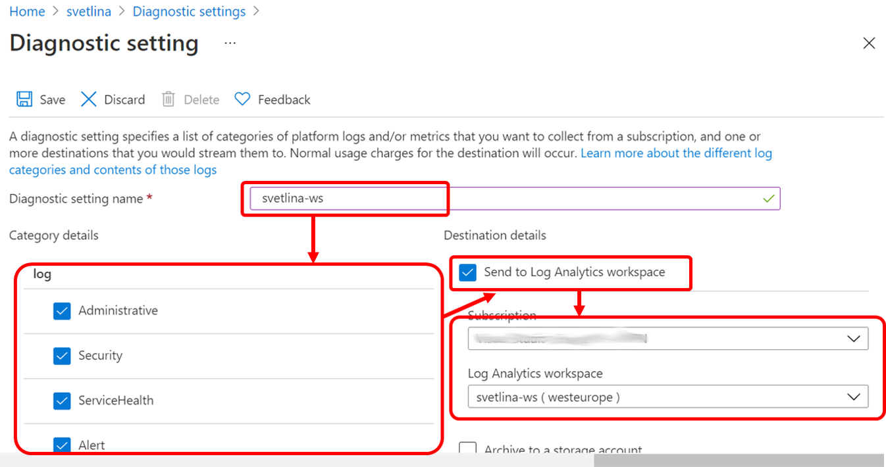
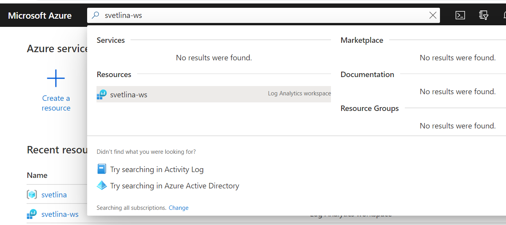
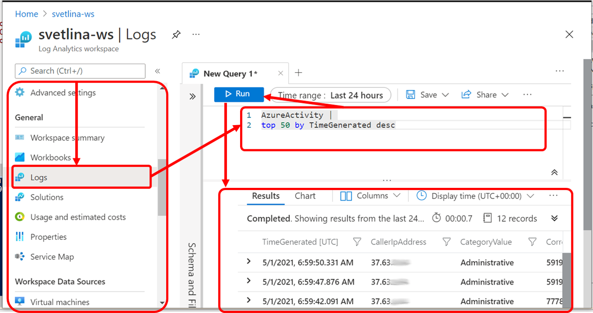

# How to send Azure Activity Log to Log Analytics Workspace?

[TOC]

## Connect Azure Activity Log to Log Analytics Workspace

1. Open the resource group diagnostic settings: From the Azure Portal search for the name of the resource group `svetlina`  and select it from the *Resource Groups* results.
    

2. From the resource group menu select the *Activity Log* option and click the *Diagnostics settings* link
    
    
3. Click the *Add diagnostic setting* link

4. Give a name to the new diagnostic setting (e.g. `svetlina_ws`), select categories you want to be sent to the workspace, select the *Send to Log Analytics workspace* option and find the log analytics workspace you want to be used as target:
      

5. Click *Save* to save the diagnostic settings

   


## Query Activity Log from Log Analytics Workspace

We started collecting Activity Log events into a Log Analytics Workspace. But how we can query the workspace?

1. From Azure Portal search for the workspace by name `svetlina-ws`. Select the log analytics workspace from the resource results.
    

2. From the workspace resource menu find and select the Logs option. In the query area enter the following query and press the `Run` button to execute the query. Explore the result
```
    AzureActivity | 
    top 50 by TimeGenerated desc
```
The query returns the last 50 logged activities.



