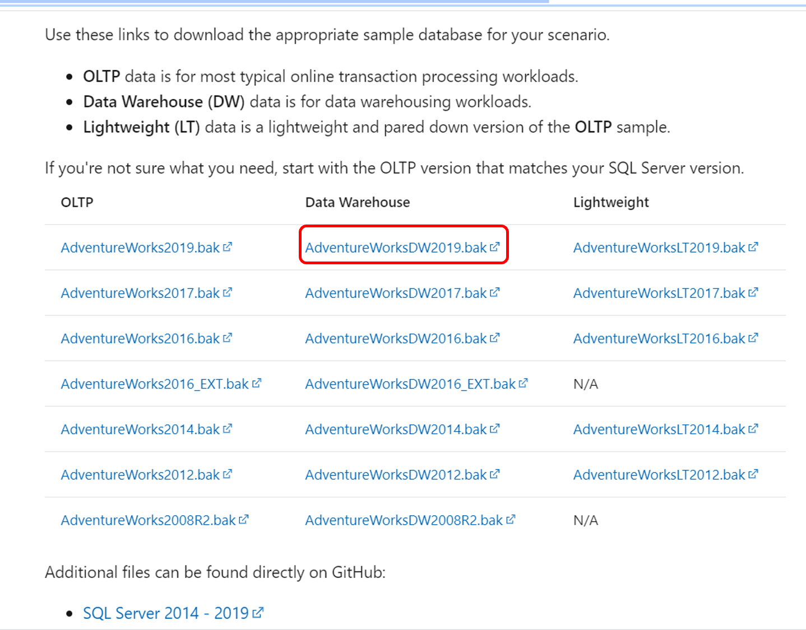
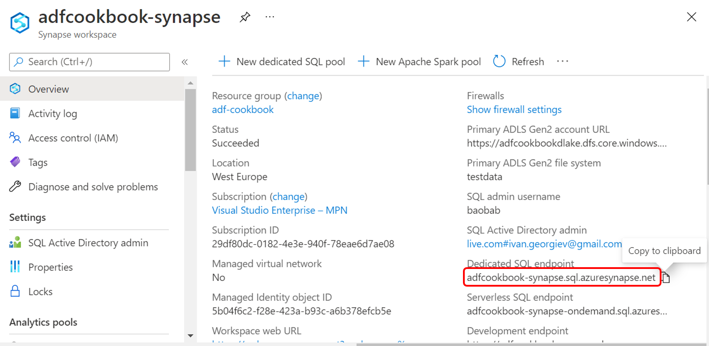
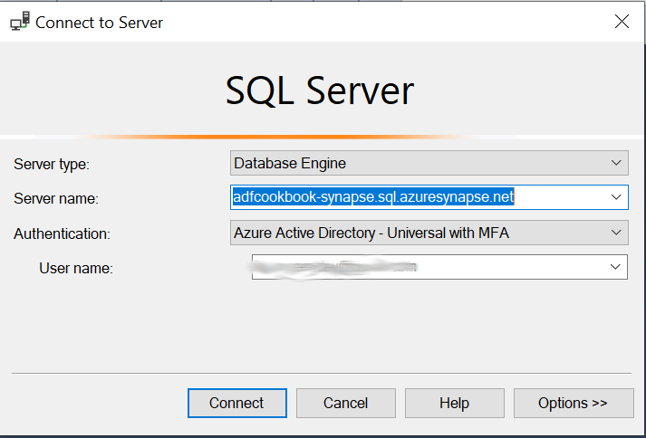

## Adventure Works Sample Database

You need:

* [SQL Server Management Studio](https://docs.microsoft.com/en-us/sql/ssms/download-sql-server-management-studio-ssms)
* Azure Synapse Analytics
  * Workspace name: adfcookbook-synapse

Download the [backup files](https://docs.microsoft.com/en-us/sql/samples/adventureworks-install-configure?view=sql-server-ver15&tabs=ssms).

### Connect to Synapse Workspace

See also: https://docs.microsoft.com/en-us/azure/synapse-analytics/sql/connect-overview

First you need to find the Dedicated SQL endpoint.

Connect SQL Server Management Studio (SSMS) using Azure Active Directory MFA authentication or SQL Server Authentication

