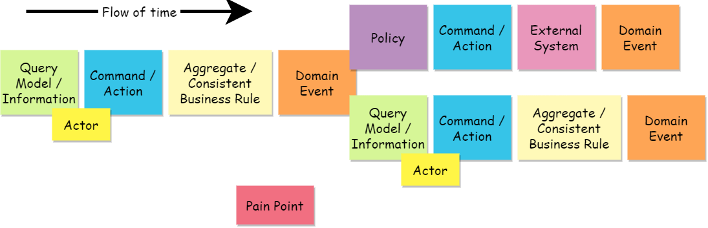

# The Event Storming Process

## Step 1. Unstructured Exploration

## Step 2. Timelines

## Step 3. Pain Points

## Step 4. Pivotal Events

## Step 5. Commands

## Step 6. Policies

## Step 7. Read Models

## Step 8. External Systems

## Step 9. Aggregates

## Step 10. Bounded Context

* [EventStorming Glossary & Cheat sheet](https://virtualddd.com/learning-ddd/ddd-crew-eventstorming-glossary-cheat-sheet)

